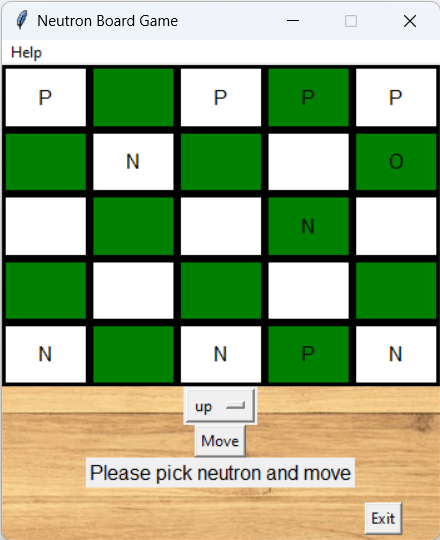

# Neutron Board Game

## Table of Contents
- [Overview](#overview)
- [Features](#features)
- [Getting Started](#getting-started)
  - [Prerequisites](#prerequisites)
  - [Running the Game](#running-the-game)
- [Project Structure](#project-structure)
- [Testing](#testing)
- [Documentation](#documentation)
- [License](#license)
- [Author](#author)
- [Screenshots](#screenshots)

## Screenshots


## Overview
This project was made during my studies at Warsaw University of Technology.

The Neutron Board Game is a turn-based strategic board game implemented in Python using the Tkinter library for its graphical user interface. Players move pieces on a board, with the objective of capturing or blocking the neutron piece.

## Features

- 🎨 **Graphical User Interface (GUI)**: Built using Tkinter, the game offers a visually appealing board and intuitive interactions.
- 🤖 **Player Mechanics**: Players can be either human or computer-controlled. Computer players can follow different strategies, such as random or smart moves.
- 📜 **Game Rules**: Manage the state and rules of the board, ensuring valid moves and tracking game progress. [link](https://en.wikipedia.org/wiki/Neutron_(game))

## Getting Started

### Prerequisites

- 🐍 Python 3.x
- 📦 Tkinter (usually comes bundled with Python)
- ✅ pytest (for running tests)

### Running the Game

To start the game, simply run the `main.py` script:

```
python main.py
```
Alternatively, it is possible to launch the game by the .exe file placed in 'dist' directory

## Project Structure
```plaintext
Neutron-Board-Game/
├── .dist/                          # Directory with exe file  
├── .tests/                         # Directory with tests
├── .gallery/                       # Directory with pictures
├── board_gui.py                    # Defines the GUI components of the game
├── neutron_board.py                # Contains the game's logic and board representation
├── player.py                       # Defines player mechanics and strategies
├── main.py                         # The main entry point of the game
├── Documentation_En.md
├── Documentacja.pdf                # Documentation in polish 
└── LICENSE                         # License file
```

## Testing

To ensure the integrity and correctness of the game mechanics, unit tests have been provided. To run the tests using pytest, execute:

```
pytest test_board.py
pytest test_player.py
```

## Documentation

For a detailed understanding of the game mechanics, rules, and implementation details, refer to the `Dokumentacja.pdf` or `Documentation_En.md` (in English) document provided with the project.

## License

This project is licensed under the MIT License. It grants you the rights to use, copy, modify, merge, publish, distribute, sublicense, and sell copies of the software, provided that you state the changes made and include the original copyright notice and disclaimers in any copies of the software.

For the full license text, refer to the `LICENSE` file included in the project repository.

---

## Author
Stanislaw Dutkiewicz 329076
